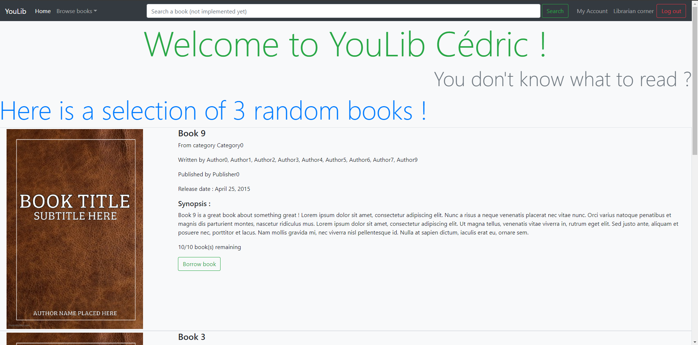
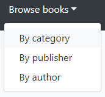
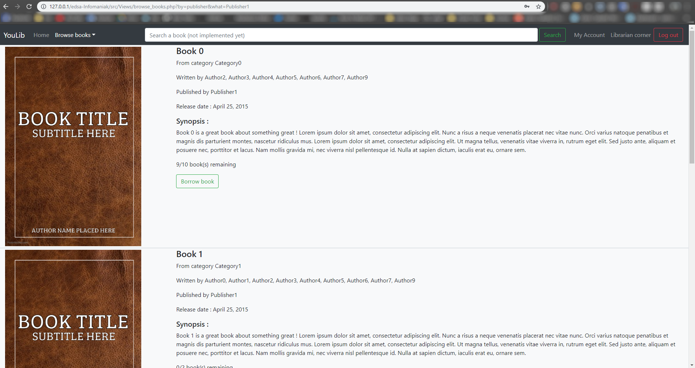
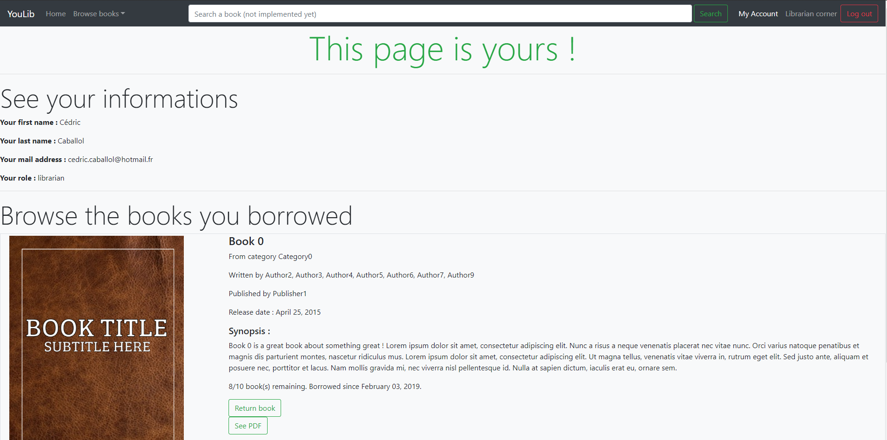
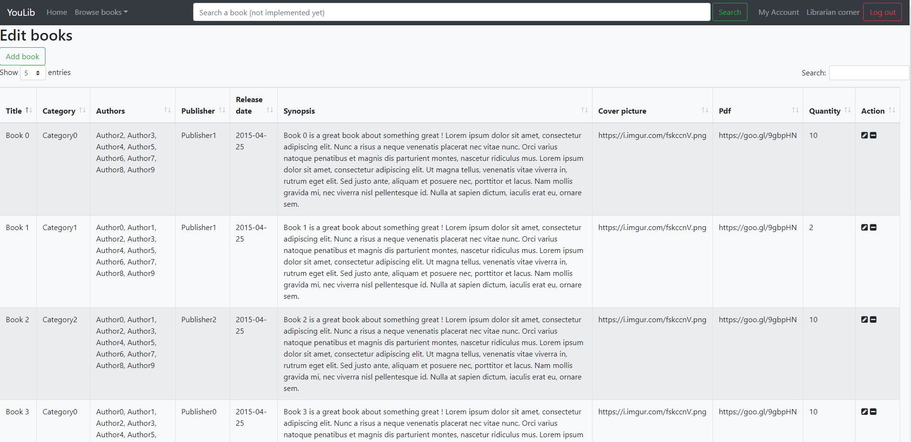
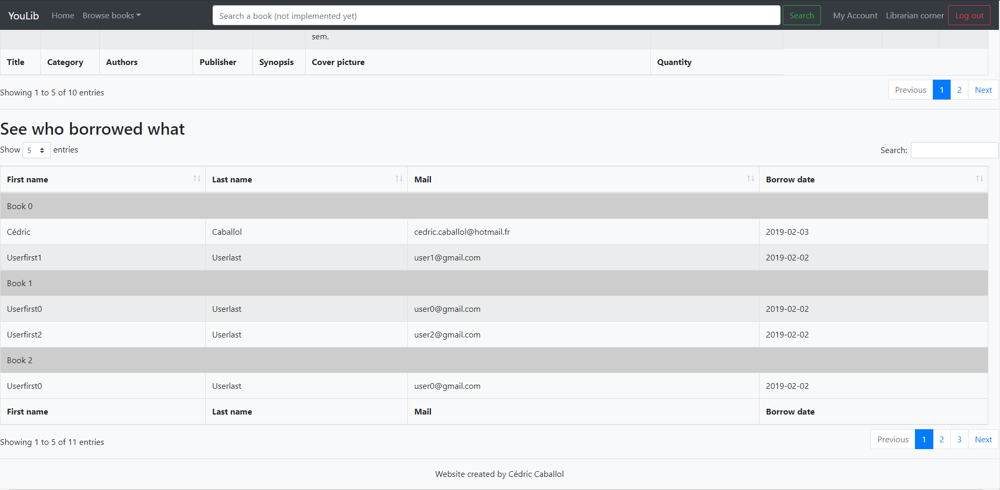
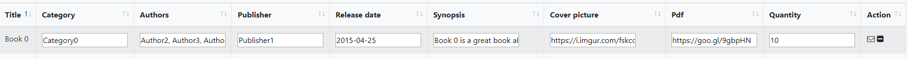

# Library exercise report - YouLib

I've chosen to develop my website with PHP 7 using [Doctrine](https://www.doctrine-project.org/index.html) to create and handle my database entities.

For the front-end, I used Bootstrap 4 and a bit of jQuery.


## Summary

* [Project architecture](#Project-architecture)
* [Database architecture](#Database-architecture)
* [Installation](#Installation)
* [Website overview](#Website-overview)
* [What I want to implement in the future](#What-I-want-to-implement-in-the-future)


## Project architecture
### The snippets folder 
As I'm learning Doctrine by doing this project, I've created some code snippets to figure out how to use it. It includes several files interacting with the entities I've created.

### The src folder
This is the principal one. It includes my MVC structure. Entities are in ```Models/```, human-machine interfaces are in ```Views/``` and all the code in-between is in ```Controllers/```.

### The db_filling_scripts
This folder contains scripts to test our database with fake data, to run them use ```filler.php```. This script orchestrates all the scripts to make consistant objects and save them to the database.

### The documentation folder
This last folder contains this ```info.md``` + every pictures associated.


### composer.json, bootstrap.php and cli-config.php files
These are configuration files for Composer and Doctrine's ORM and DBAL. See details in the installation part.


## Database architecture


This database is generated by the ```src/Models/``` entities thanks to Doctrine.


## Installation

Place yourself in the root folder with your shell.

You need [Composer](https://getcomposer.org/) to install libraries and auto-load files.

Change the bootstrap.php file to your convenience (it's set by default with MySQL drivers, the database's name is ```library```). 

Here are some parameters if you use an other driver :

- SQLite drivers :

```
<?php
[
    'driver'   => 'pdo_sqlite',
    'path'   => 'data/library.sqlite'
];
```

Think to create a data folder if you go for SQLite.

- PostgreSQL drivers :

```
<?php
[
    'driver'   => 'pdo_pgsql',
    'host'     => 'localhost',
    'charset'  => 'utf8',
    'user'     => 'root',
    'password' => '',
    'dbname'   => 'library',
];
```

For more information, go [here](https://www.doctrine-project.org/projects/doctrine-dbal/en/latest/reference/configuration.html).

You don't have to change cli-config.php.

Do ```composer install``` to install all libraries.

Do ```vendor/bin/doctrine``` to make sure Doctrine works.

Do ```composer dump-autoload``` to start the Composer autoloader. It will create a new file named ```composer.lock```.

Installation is done ! Now you can run these Doctrine commands : 

```vendor/bin/doctrine orm:schema-tool:create``` to create your tables

```vendor/bin/doctrine orm:schema-tool:drop --force``` to delete your tables

```vendor/bin/doctrine orm:schema-tool:update --dump-sql --force``` to update your tables


When the database is set up, use the scripts I've written in ```db_filling_scripts/``` to fill it with fake data. 
To do so, run ```php db_filling_scripts/filler.php```.

When it's done access to the website and you can sign in with the fake librarian account :
 
 Login : ```user0@gmail.com```

Password : ```123```


## Website-overview

### User side



Here is the index page, I've chosen to display 3 random books for the user to discover new things.

If you don't like the random selection, there is no problem ! Go to ```Browse books``` in the top left corner...

You will have the choice between browsing books by category, by publisher or by author thanks to this dropdown menu.



Here is what you find when you browse by publisher and choose ```Publisher1``` :



It's the same view as the random one but categorized.
From these views, you can see informations about the book. You can also borrow, see the pdf or return one.

When you have borrowed a book, you can retrieve it in the page ```My account``` accessible in the top right corner :

 

### Librarian side

Click in the top right corner's button called ```Librarian corner``` to add/edit/remove books...

 

And see who borrowed what.
 
 
Those tables are implemented with jQuery's library [Datatables](https://datatables.net/). 
Here is the view you have when editing a book, texts are replaced by inputs : 
  
  

## What I'd like to implement in the future : 

- The search bar in the navigation bar is here but not yet implemented, it will be my next mission. I want it to be
intelligent, like you search with a few letters and it shows you the right things.
- Javascript validations for the librarian... Because at this moment, a librarian can type anything in the inputs...
- Why not a notation system for the books you read ?