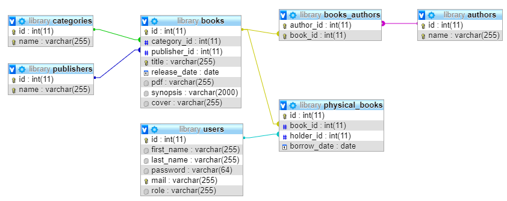

# Library exercise report

This project is still in development, I'm updating it regularly.

I've chosen to develop my website using [Doctrine](https://www.doctrine-project.org/index.html).
##
### The snippets folder 
As I'm learning Doctrine by doing this project, I've created some code snippets to figure out how to use it. It includes several files interacting with the entities I've created.

### The src folder
This is the principal one. It includes my MVC structure. Entities are in ```Models/```, human-machine interfaces are in ```Views\``` and all the code in-between is in ```Controllers\```.

### The vendor folder
This folder contains Doctrine library.

### The db_filling_scripts
This folder contains scripts to test our database with fake data, to run them use ```filler.php```. This script orchestrates all the scripts to make consistant objects and save them to the database.

### The documentation folder
This last folder contains this ```info.md``` + every pictures associated.


### composer.json, bootstrap.php and cli-config.php files
These are configuration files for Composer and Doctrine's ORM and DBAL. See details in the installation part.


## Database architecture


This database is generated by the ```src/Models/``` entities thanks to Doctrine.


## Installation

Place yourself in the root folder with your shell.

You need [Composer](https://getcomposer.org/) to auto-load files.

Change the bootstrap.php file to your convenience (it's set by default with MySQL drivers, the database's name is ```library```). 

Here are some parameters if you use an other driver :

- SQLite drivers :

```
<?php
[
    'driver'   => 'pdo_sqlite',
    'path'   => 'data/library.sqlite'
];
```

Think to create a data folder if you go for SQLite.

- PostgreSQL drivers :

```
<?php
[
    'driver'   => 'pdo_pgsql',
    'host'     => 'localhost',
    'charset'  => 'utf8',
    'user'     => 'root',
    'password' => '',
    'dbname'   => 'library',
];
```

For more information, go [here](https://www.doctrine-project.org/projects/doctrine-dbal/en/latest/reference/configuration.html).

You don't have to change cli-config.php.

Do ```vendor/bin/doctrine``` to make sure Doctrine works.

Do ```composer dump-autoload``` to start the Composer autoloader. It will create a new file named ```composer.lock```.

Installation is done ! Now you can run these Doctrine commands : 

```vendor/bin/doctrine orm:schema-tool:create``` to create your tables

```vendor/bin/doctrine orm:schema-tool:drop --force``` to delete your tables

```vendor/bin/doctrine orm:schema-tool:update --dump-sql --force``` to update your tables

When the database is set up, you can use the scripts I've written in ```db_filling_scripts/``` to fill it with fake data.